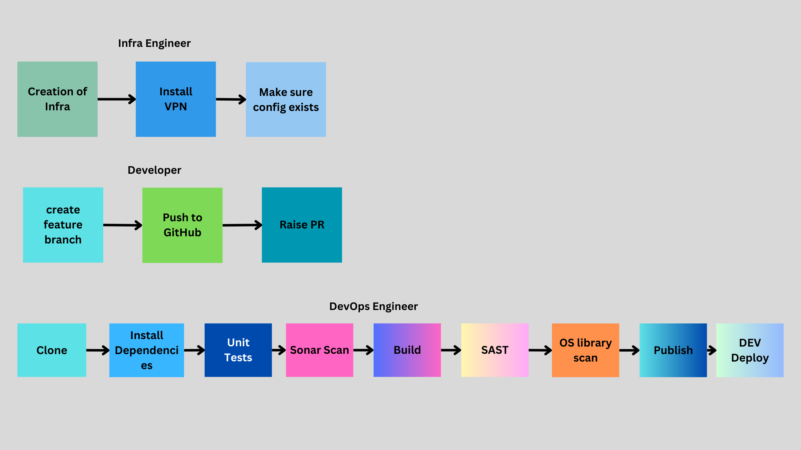
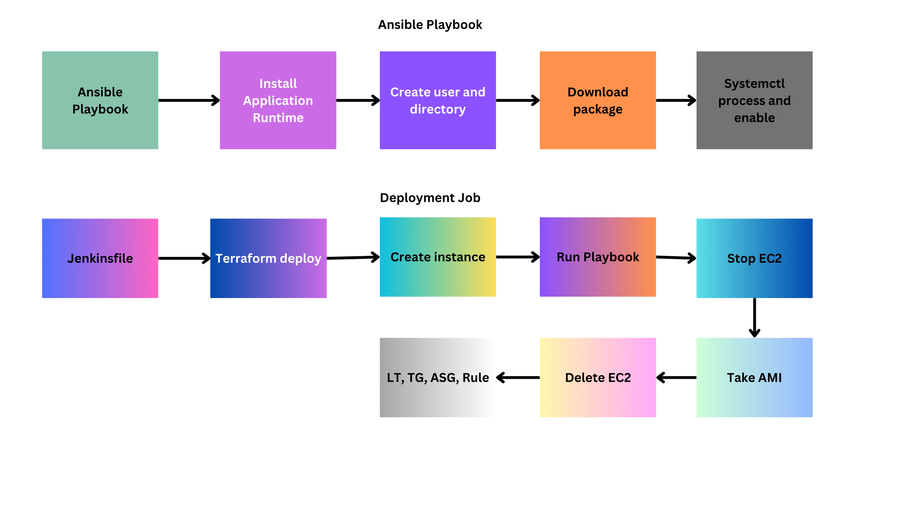

### CICD

We are using below process to deploy the applications into DEV and PROD.

**Tools used:**
* Jenkins
* Terraform
* Ansible
* Nexus
* Sonarqube

**Concepts:**
* Jenkins shared libraries
* Multi branch pipeline

What we are doing now is the actual CICD integration. We can have CICD for infrastructure and application deployment.

Basically we can divide the project into 2 types.
1. #### Project infra
    * mostly one time creations like VPC, DB, LB, Firewalls, etc. there will be occasional changes like firewalls, DB upgrades, etc. **We don't delete infrastructure once it is created.**

    * You can create/maintain entire infra through a single GIT repo. But number of terraform refresh operations will be increased and tough to maintain.

    * It is better to maintain different repos for different set of services as we are doing now. Common configuration can be shared through SSM parameter store.  
    
    * Make sure infra plan is reviewed, tested, scanned for vulnerabilities before apply.

    **NOTE: Just to reduce the complexity we are maintaining different folders inside the repo** imagine these are different repos.
2. #### Application Infra
    * Application infra is frequently changed resources as part of release/deployment.
    * launch templates, refreshing autoscaling, targe groups, listener rules,etc are part of this application infra.
    * Developers can write this too.
    * We are gradually removing the old version and making up the new version of application.

#### Application CICD:
* We are following **shift-left** practice to deploy applications. Shift-left is doing every thing in DEV like scanning, unit testing, deployment, functional testing, etc.
* **Build once and Run any where**. Build should be only in DEV, it means code is same in all environments, only configuration is changed.
* We are using multi branch pipelines, feature branches is only for DEV deployment.
* Once DEV deployment is over, we can deploy applications to any higher environments like SIT, UAT, etc.
* PROD deployments must happen through CR and JIRA process.

#### Complete flow
We are following the below process in our trainings.
* First we are creating DEV infra. I created a apply pipeline where below resources are created in order.
    * VPC
    * SG
    * VPN
    * Databases
    * APP-ALB
* A destroy pipeline is there just to save the cost, in realtime there is no destroy process explicitly.
* Once DEV/PROD infra is ready, we can start deploying applications. let's take example of catalogue, all other apps follow the same process.
* We have Jenkinsfile in catalogue that is loading shared libraries. Catalogue will send the application type i.e nodejsVM and component name i.e catalogue to pipelineDecission.
* We have a method/function in pipelineDecission to decidePipeline based on application type.
* We can have a file called pipelineGlobals where we can mention all the static values of the CICD.
* We run nodejsVM pipeline that can have stages  
  CI:
    * read version from package.json
    * install dependencies.
    * unit tests
    * build
    * sonar scan
    * SAST
    * library scan
    * DAST
    * Nexus Upload
* CD:
    * Deploy
        * We have a customized terraform-roboshop-app module. Our catalogue-deploy will have a terraform folder where we can call terraform-roboshop-app module
        * catalogue-deploy will have a separate configuration for each environment including separate tfvars.
        * We will get the ENV, version from the params. By default DEV pipeline sends the dev environment and version uploaded to nexus.
        * Terraform deploy process pulls ansible playbook, we need to send the app version to ansible playbook so that ansible can download artifact from nexus.
        * Make sure you configure proper Nexus URL in ansible.
    * Functional tests
        * Developers/Testers are responsible to create functional tests.
    * Destroy (if Developer opts)
        * Developers can destroy the application when they complete the development.

**NON-DEV and NON-PROD**
* DevOps can trigger deployments to any NON-PROD environment.

**PROD Deployment**
We should understand Change management process.