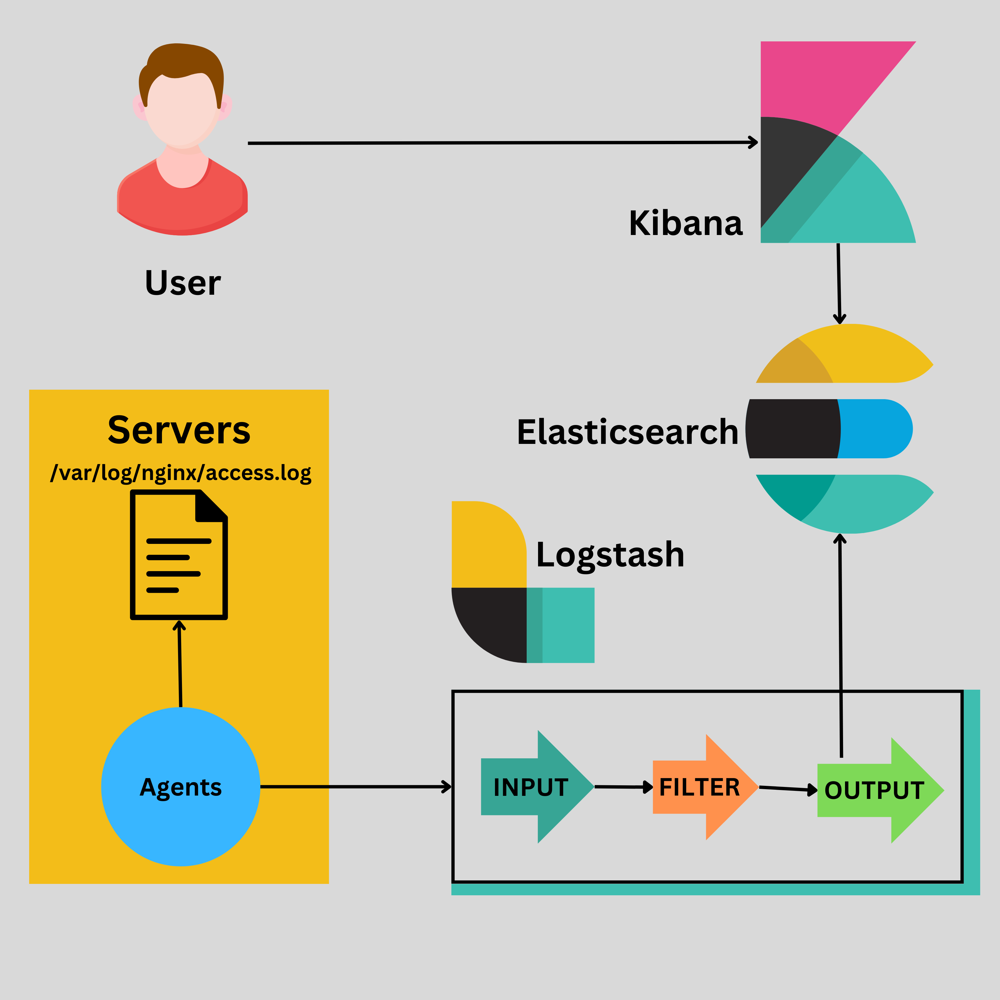

### ELK Monitoring

Monitoring is very important part of DevOps, because whatever the work we did is reflected in monitoring. We have to proactively monitor the systems and get alerts immediately when something goes wrong so that business will not go down.

Let's take 2 cases.
* We are not doing any monitoring, if something goes wrong we can wait for someone to report our system is down.
* We are doing proactive monitoring, instead waiting for someone to report we can predict the errors, failures and raise alerts so that business will not go down.

#### White-box monitoring

Monitoring based on metrics exposed by the internals of the system, including logs, interfaces like the Java Virtual Machine Profiling Interface, or an HTTP handler that emits internal statistics.

#### Black-box monitoring
Testing externally visible behavior as a user would see it.

#### Dashboard
An application (usually web-based) that provides a summary view of a service’s core metrics. A dashboard may have filters, selectors, and so on, but is prebuilt to expose the metrics most important to its users. The dashboard might also display team information such as ticket queue length, a list of high-priority bugs, the current on-call engineer for a given area of responsibility, or recent pushes.

#### Alert
A notification intended to be read by a human and that is pushed to a system such as a bug or ticket queue, an email alias, or a pager. Respectively, these alerts are classified as tickets, email alerts,22 and pages.

#### Root cause
A defect in a software or human system that, if repaired, instills confidence that this event won’t happen again in the same way. A given incident might have multiple root causes: for example, perhaps it was caused by a combination of insufficient process automation, software that crashed on bogus input, and insufficient testing of the script used to generate the configuration. Each of these factors might stand alone as a root cause, and each should be repaired.

### The Four Golden Signals

#### Latency
The time it takes to service a request. It’s important to distinguish between the latency of successful requests and the latency of failed requests. For example, an HTTP 500 error triggered due to loss of connection to a database or other critical backend might be served very quickly; however, as an HTTP 500 error indicates a failed request, factoring 500s into your overall latency might result in misleading calculations. On the other hand, a slow error is even worse than a fast error! Therefore, it’s important to track error latency, as opposed to just filtering out errors.

#### Traffic
A measure of how much demand is being placed on your system, measured in a high-level system-specific metric. For a web service, this measurement is usually HTTP requests per second, perhaps broken out by the nature of the requests (e.g., static versus dynamic content). For an audio streaming system, this measurement might focus on network I/O rate or concurrent sessions. For a key-value storage system, this measurement might be transactions and retrievals per second.

#### Errors
The rate of requests that fail, either explicitly (e.g., HTTP 500s), implicitly (for example, an HTTP 200 success response, but coupled with the wrong content), or by policy (for example, "If you committed to one-second response times, any request over one second is an error"). Where protocol response codes are insufficient to express all failure conditions, secondary (internal) protocols may be necessary to track partial failure modes. Monitoring these cases can be drastically different: catching HTTP 500s at your load balancer can do a decent job of catching all completely failed requests, while only end-to-end system tests can detect that you’re serving the wrong content.

#### Saturation
How "full" your service is. A measure of your system fraction, emphasizing the resources that are most constrained (e.g., in a memory-constrained system, show memory; in an I/O-constrained system, show I/O). Note that many systems degrade in performance before they achieve 100% utilization, so having a utilization target is essential.
In complex systems, saturation can be supplemented with higher-level load measurement: can your service properly handle double the traffic, handle only 10% more traffic, or handle even less traffic than it currently receives? For very simple services that have no parameters that alter the complexity of the request (e.g., "Give me a nonce" or "I need a globally unique monotonic integer") that rarely change configuration, a static value from a load test might be adequate. As discussed in the previous paragraph, however, most services need to use indirect signals like CPU utilization or network bandwidth that have a known upper bound. Latency increases are often a leading indicator of saturation. Measuring your 99th percentile response time over some small window (e.g., one minute) can give a very early signal of saturation.
Finally, saturation is also concerned with predictions of impending saturation, such as "It looks like your database will fill its hard drive in 4 hours."
If you measure all four golden signals and page a human when one signal is problematic (or, in the case of saturation, nearly problematic), your service will be at least decently covered by monitoring.

### ELK



ELK is a stack/suit from elasticsearch. 

#### Elasticsearch

Elasticsearch is a distributed search and analytics engine designed with horizontal scalability, real-time search, and data storage. It uses are
* log and event data analysis
* full-text search
* business intelligence

#### Kibana

Kibana is a data visualization that often used with Elasticsearch. It is UI and Elasticsearch is DB.

#### Logstash

Logstash is a data collection and processing tool. It takes the input from different sources, filter into our required format and outputs to elasticsearch.

#### Filebeat

A collection agent that can access the logs and continuously push them to Logstash.

### Installation

1. Install Java
```
yum install java-11-openjdk-devel -y

```
2. Add the repo

```
vim /etc/yum.repos.d/elasticsearch.repo
```

```
[elasticsearch]
name=Elasticsearch repository for 7.x packages
baseurl=https://artifacts.elastic.co/packages/7.x/yum
gpgcheck=1
gpgkey=https://artifacts.elastic.co/GPG-KEY-elasticsearch
enabled=1
autorefresh=1
type=rpm-md
```

2. Install elasticsearch

```
yum install elasticsearch -y
```

3. Open the elastic config file and make sure we uncomment
```
vim /etc/elasticsearch/elasticsearch.yml
```

* http.port: 9200
* Give network host as 
network.host: 0.0.0.0
* Enter a line under discovery section
```
discovery.type: single-node
```

4. Restart elasticsearch

```
systemctl restart elasticsearch
```

5. Test Elastic search
```
curl localhost:9200
```

**Sample Output:**
```
{
  "name" : "ip-172-31-23-26.ec2.internal",
  "cluster_name" : "elasticsearch",
  "cluster_uuid" : "S5rDTZXASMWuu60v1i6HrQ",
  "version" : {
    "number" : "7.17.13",
    "build_flavor" : "default",
    "build_type" : "rpm",
    "build_hash" : "2b211dbb8bfdecaf7f5b44d356bdfe54b1050c13",
    "build_date" : "2023-08-31T17:33:19.958690787Z",
    "build_snapshot" : false,
    "lucene_version" : "8.11.1",
    "minimum_wire_compatibility_version" : "6.8.0",
    "minimum_index_compatibility_version" : "6.0.0-beta1"
  },
  "tagline" : "You Know, for Search"
}
```
6. Enable elasticsearch
```
systemctl enable elasticsearch
```
#### Kibana

1. Install kibana

```
yum install kibana -y
```

2. Open the kibana config
```
vim /etc/kibana/kibana.yml
```
3. Uncomment
* server.port: 5601
* server.host: "0.0.0.0" keep the value as 0.0.0.0 so that we can open kibana from internet.
* elasticsearch.hosts: ["http://localhost:9200"]

3. Start and Enable kibana

```
systemctl restart kibana
```

```
systemctl enable kibana
```

#### Logstash

1. Install logstash

```
yum install logstash -y
```

2. Configure logstash input and output

```
vim /etc/logstash/conf.d/logstash.conf
```

```
input {
  beats {
    port => 5044
  }
}

output {
  elasticsearch {
    hosts => ["http://localhost:9200"]
    index => "%{[@metadata][beat]}-%{[@metadata][version]}"
  }
}

```

3. Start and Enable logstash

```
systemctl restart logstash
```

```
systemctl enable logstash
```

#### Filebeat

1. Add the repo

```
vim /etc/yum.repos.d/elasticsearch.repo
```

```
[elasticsearch]
name=Elasticsearch repository for 7.x packages
baseurl=https://artifacts.elastic.co/packages/7.x/yum
gpgcheck=1
gpgkey=https://artifacts.elastic.co/GPG-KEY-elasticsearch
enabled=1
autorefresh=1
type=rpm-md
```

2. Install filebeat

```
yum install filebeat -y
```

3. Open the filebeat config

```
vim /etc/filebeat/filebeat.yml
```

- Set `enabled: true` under filebeat.inputs
- Under paths: modify the log path to `/var/log/nginx/access.log`
- Specify the elasticsearch IP address for the host variable under output.elasticsearch section

4. Start filebeat service

```
systemctl start filebeat
```

- We can check whether the connection is established or not using `tail -f /var/log/messages` file

#### Grok filter

**nginx log**
```
'$remote_addr [$time_local] $request $status $body_bytes_sent "$http_referer" $request_time'
```

**Sample Value**
```
49.37.170.160 [15/Dec/2023:00:51:38 +0000] GET /api/catalogue/categories HTTP/1.1 404 571 "http://54.242.20.135/" 0.000
```

**Sample Grok**
```
%{IP:client_ip} \[%{HTTPDATE:timestamp}\] %{WORD:http_method} %{URIPATH:request_path} %{NOTSPACE:http_version} %{NUMBER:status:int} %{NUMBER:response_size:int} \"%{URI:referrer}\" %{NUMBER:response_time:float}
```

**Sample Logstash**
```
input {
  beats {
    port => 5044
  }
}
filter {
      grok {
        match => { "message" => "%{IP:client_ip} \[%{HTTPDATE:timestamp}\] %{WORD:http_method} %{URIPATH:request_path} %{NOTSPACE:http_version} %{NUMBER:status:int} %{NUMBER:response_size:int} \"%{URI:referrer}\" %{NUMBER:response_time:float}" }
      }
}
output {
  elasticsearch {
    hosts => ["http://localhost:9200"]
    index => "%{[@metadata][beat]}-%{[@metadata][version]}"
  }
}
```